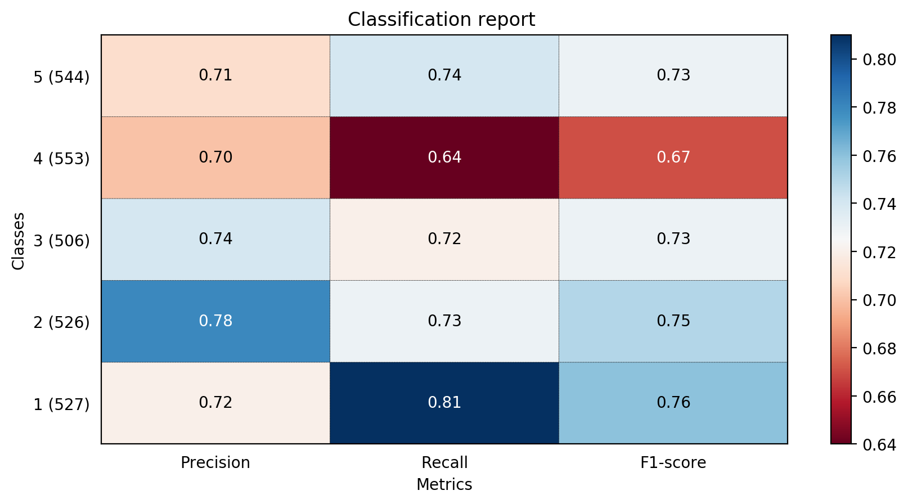

# reviewer

## Rating prediction of mobile phone reviews from Amazon

### Goal

The objective of this project is to attempt the prediction of Amazon review ratings from the [Unlocked Mobile Phones](https://www.kaggle.com/PromptCloudHQ/amazon-reviews-unlocked-mobile-phones) dataset.

Semestrial project for Natural Language Processing, Spring 2018.

### How it works

1. The dataset is loaded in a `pandas` DataFrame object and textual features extracted from the `Reviews` field:
    - Words written only with uppercase letters (possible ranting...)
    - Number of positive, smiling emoticons
    - Number of negative, sad emoticons
    - Number of exclamation marks
    - Review length
    - The review itself with stopwords filtered and all words in lowercase

    This file is saved as `proc.csv` in the project root. Sample line from this file:
    ```
    "Rating","Review Votes","caps","posicon","negicon","excl","length","proc"
    4,0.0,1,0,0,0,76,"works good goes slow sometimes good phone love"
    ```
    
    Or:

    |Rating|Review Votes|caps|posicon|negicon|excl|length|proc|
    |------|------------|----|-------|-------|----|------|------------------------------------------------|
    |4     |0           |1   |0      |0      |0   |76    |"works good goes slow sometimes good phone love"|

Before feeding it to the pipeline, the data is resampled using `imblearn` undersampling. 

2. The preprocessed text is needed for another processing step by `StemmedTfidfVectorizer`, a class that creates the TF-IDF matrix 
for all documents, while also stemming every term. This is also used by `SentiVectorizer` to create a similar sparse matrix to TF-IDF, 
but in this case, sentiment values obtained with `TextBlob` are inserted for n-grams in the matrix. The `TextBlob` library uses a
Naive Bayes classifier trained on the `movie_reviews` corpus from `nltk` to extract objectivity and polarity from the given n-gram.

All features are then passed to the supervised classifier for training. The model is trained with 80% of the data and evaluated on 
the remaining 20%. The trained model (pipeline) is serialized (pickled) as `pipeline.pkl`.

*Note: both `proc.csv` and `pipeline.pkl` should be removed before re-training the model on newly added features. It's enough to remove
the pickle file in case only the model is changed (e.g. when using a different classifier).*

### Results

Classification reports of several classifiers.

#### Logistic Regression



#### SVM (with OneVsRest)


#### Random Forest


#### Overall

|Classifier         |Precision|Recall  |F1      | 
|-------------------|---------|--------|--------|
|Logistic Regression|0.73     |0.73    |0.73    |
|SVM                |0.66     |0.48    |0.53    |
|**Random Forest**  |**0.77** |**0.76**|**0.76**|

Random Forest seems to perform slightly better than Logistic Regression, while SVM stays far behind.

### Sources

- [Kaggle: Unlocked Mobile Phones dataset](https://www.kaggle.com/PromptCloudHQ/amazon-reviews-unlocked-mobile-phones)
- [Kaggle: Work like a pro with pipelines and feature unions](https://www.kaggle.com/metadist/work-like-a-pro-with-pipelines-and-feature-unions)
- [Kaggle: A deep dive into sklearn pipelines](https://www.kaggle.com/baghern/a-deep-dive-into-sklearn-pipelines)
- [Kaggle: Resampling strategies for imbalanced datasets](https://www.kaggle.com/rafjaa/resampling-strategies-for-imbalanced-datasets)
- [Tweet tokenizer source code from NLTK](https://www.nltk.org/_modules/nltk/tokenize/casual.html)
- [How to plot scikit learn classification report?](https://stackoverflow.com/questions/28200786/how-to-plot-scikit-learn-classification-report)